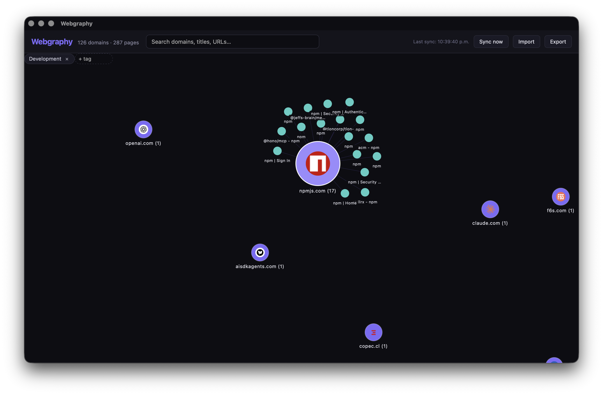

# Webgraphy

[](https://www.npmjs.com/package/webgraphy)
[](https://www.npmjs.com/package/webgraphy)
[](https://github.com/felipeinf/webgraphy/stargazers)
[](https://github.com/felipeinf/webgraphy/issues)
[](https://github.com/felipeinf/webgraphy)
[](LICENSE)
[](https://github.com/felipeinf/webgraphy)

Lightweight macOS app that imports open tabs from Safari, Chrome, and Opera into a deduplicated, domain-grouped force-directed graph.



## Install

macOS Apple Silicon (arm64):

```bash
npm install -g webgraphy
webgraphy
```

Or run without installing:

```bash
npx webgraphy
```

## Features

- Import open tabs from Safari, Chrome, and Opera via AppleScript
- SNSS session file fallback for Chrome/Opera when AppleScript is unavailable
- URL deduplication across browsers
- Domain nodes that expand to show individual pages
- Auto-sync every 50 seconds + manual sync
- Search by domain, title, or URL
- Remove pages from the graph (dismissed URLs won't re-import)
- Export to JSON, Markdown, or HTML bookmarks
- Double-click a page node to open in your default browser

## Requirements

- macOS
- Rust toolchain
- Node.js 18+

## macOS Permissions

Grant Automation permission in **System Settings → Privacy & Security → Automation**:

- Allow Webgraphy to control **Safari**
- Allow Webgraphy to control **Google Chrome**
- Allow Webgraphy to control **Opera**

Without these permissions, live tab import won't work. The app will attempt SNSS session file fallback for Chrome and Opera.

## Development

```bash
npm install
npm run tauri dev
```

## Build

```bash
npm run tauri build
```

## Data Storage

SQLite database: `~/.webgraphy/webgraphy.db`

## Stack

- Tauri 2 (Rust)
- React + TypeScript + Vite
- react-force-graph-2d
- SQLite (rusqlite)
- snss-core (Chromium session parsing)
